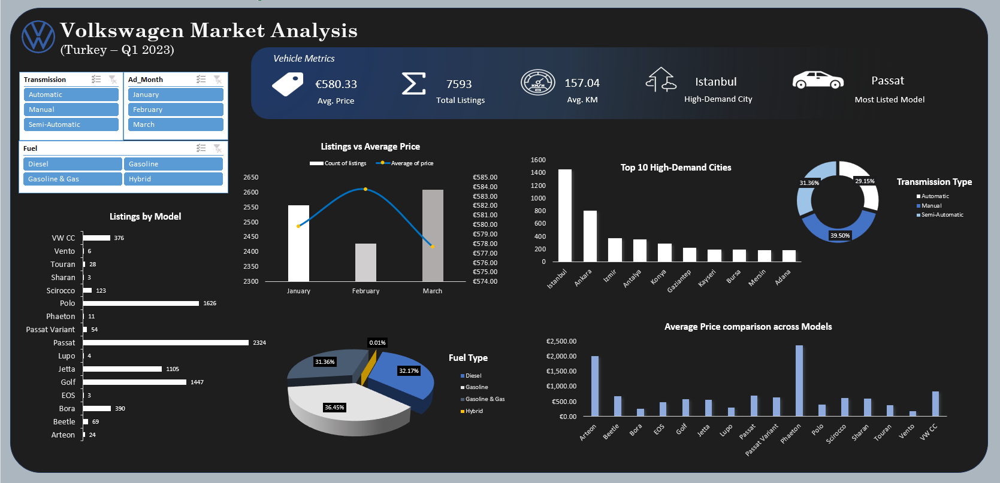

# Volkswagen Used Car Market Analysis (Q1 2023)
A data-driven analysis of Volkswagen used car listings in Turkey (January–March 2023) built using Microsoft Excel with interactive dashboard visualizations.

## Overview
This project analyzes Volkswagen used car listings in Turkey for Q1 2023 to uncover pricing patterns, demand concentration, transmission and fuel preferences and city-wise market activity. The objective was to transform raw listing data into meaningful business insights using structured data cleaning, modeling, and visualization techniques.

## Problem Statement

The used car market contains large volumes of unstructured listing data, making it difficult to identify pricing trends, high-demand models, regional hotspots and buyer preferences.  

This project aims to:
- Analyze listing volume trends across months
- Identify the most listed models and high-demand cities
- Examine asking price patterns across models
- Understand transmission and fuel type distribution
- Present insights through an interactive Excel dashboard

## Methods

### 1. Data Cleaning
- Standardized inconsistent date formats using **Power Query**
- Created structured columns (Month, Month Number, KPIs)
- Cleaned and validated categorical fields (Model, Transmission, Fuel, City)
- Handled formatting inconsistencies in price and kilometer columns

### 2. Data Modeling
- Built PivotTables for aggregation
- Created calculated KPIs:
  - Total Listings
  - Average Asking Price
  - Average Kilometer
  - Most Listed Model
  - High-Demand City
- Structured backend pivot sheet for scalable dashboard updates

### 3. Analysis and Visualization
- Performed comparative and trend analysis
- Designed an interactive dashboard with slicers
- Implemented structured visual hierarchy and professional layout
- Used combination charts to compare volume vs pricing trends

## Tools and Technologies

- Microsoft Excel
- Power Query
- PivotTables & PivotCharts
- Data Validation & Slicers
- Excel Dashboard Design

## Key Insights (KPIs)

- **Total Listings:** 7,593  
- **Average Asking Price:** €580.33  
- **Average Kilometer:** 157.04  
- **Most Listed Model:** Passat  
- **High-Demand City:** Istanbul

## Dashboard

Below is the interactive Excel dashboard developed for this analysis:

### Charts Used:
- Horizontal Bar Chart – Listings by Model  
- Combo Chart – Monthly Listings vs Average Price  
- Column Chart – Top 10 High-Demand Cities  
- Donut Chart – Transmission Type Distribution  
- Pie Chart – Fuel Type Distribution  
- Column Chart – Average Price Comparison Across Models  
- KPI Cards – Summary Metrics  

Interactive slicers allow filtering by:
- Transmission Type  
- Month  
- Fuel Type  

## Results and Conclusion

- **Passat** records the highest number of listings (2,324) with a relatively lower average asking price, indicating strong market supply. In contrast, **Phaeton** has the highest average asking price despite minimal listings (11), reflecting limited availability and premium positioning.

- Monthly analysis (Jan–Mar) shows no direct positive correlation between listing volume and average asking price. February reports the highest average price with fewer listings, suggesting a higher share of premium vehicles, while March indicates oversupply with the highest listings but lowest average price.

- Istanbul leads in both total listings and average asking price, establishing it as the primary demand and pricing hub within the dataset.

- Manual transmission vehicles dominate listings (39.5%), highlighting supply concentration in manual configurations compared to automatic and semi-automatic variants.

- Hybrid vehicles show the lowest listing volume among fuel types, indicating limited penetration in the used car market.

Overall, the dashboard provides a structured, data-driven overview of the Volkswagen used car market in Turkey for Q1 2023, enabling better understanding of pricing behavior, model popularity, and regional demand patterns.
